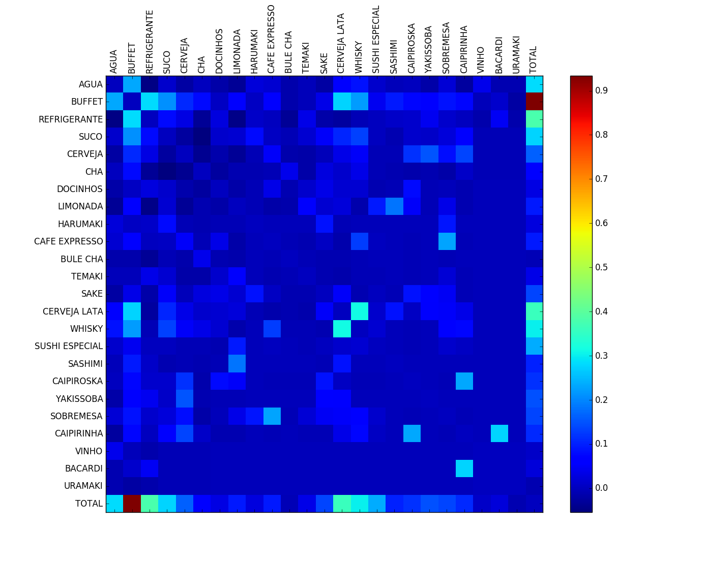
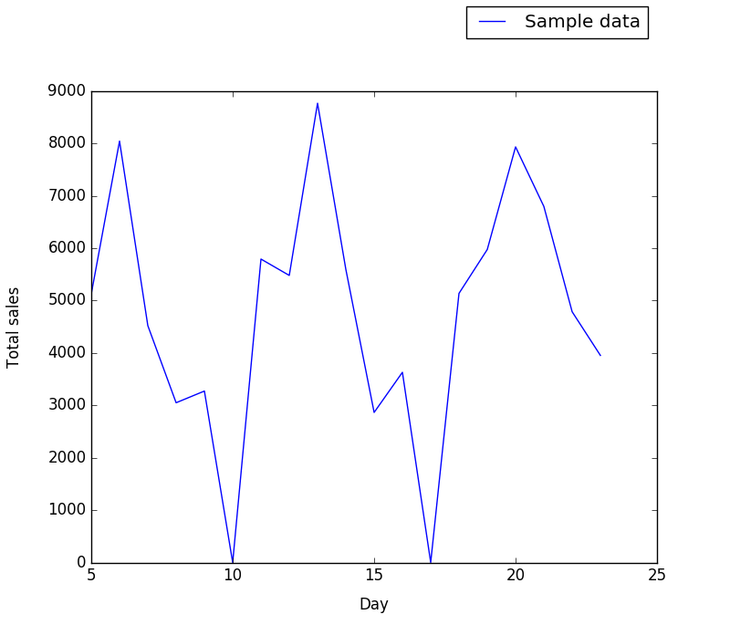
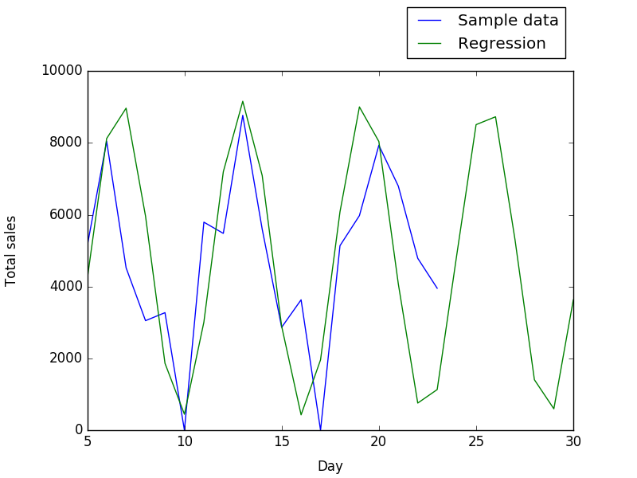
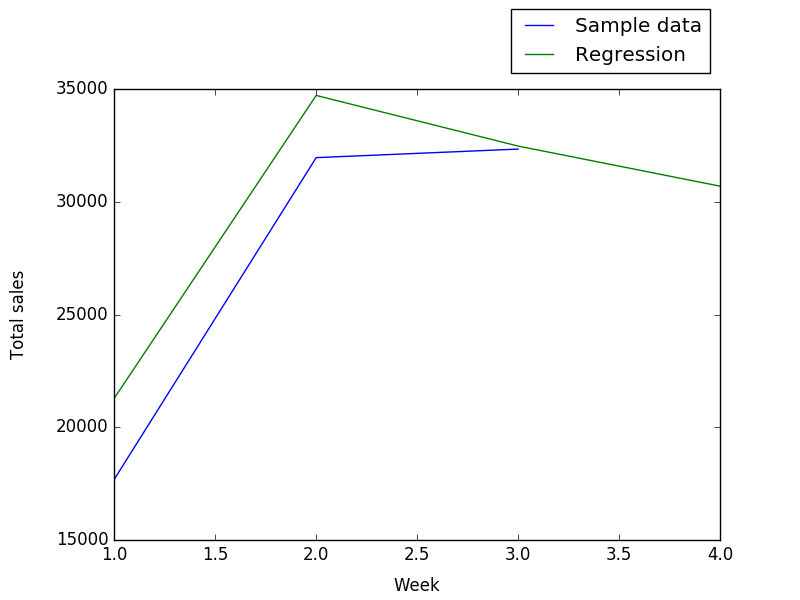

# TOTVS Code Challenge (10/2016)

The TOTVS Code Challenge was launched as a prerequisite for applying to the position of Data Scientist at the TOTVS Labs in São Paulo. It consisted of completing the following tasks on a [sample dataset](sample.txt):

1. _Parse and extract the data._
2. _Identify a pattern on any set of fields that can help predict how much a customer will spend._
3. _Calculate a sales forecast for the next week._

This document presents my solutions to those tasks, including rationale and comments to my code.

## Sample data characteristics and parsing

The sample dataset was provided as a JSON file containing a total of 1635 entries. Each entry describes a restaurant invoice, with several items listed along their prices and other information. All invoices were on behalf of "TOTVS Labs", and no patron information was available other than the table they were seating at the time.

Parsing the dataset is trivial in Python, since the JSON format is compatible to Python's data expression syntax. After loading the file to memory in text format, the `eval()` function can be used to convert its contents to a data tree. This can be accomplished in one line as below:

    def load(path):
        r'''Load dataset from file.
        '''
        return eval(''.join(line.strip() for line in open(path)))

After the raw data is loaded, each entry is converted to a vector of item prices for further processing. Vectors contain one cell for each distinct item category (24 in total), plus one cell at the end for the invoice's total value. Cells corresponding to items not present in a given invoice are set to 0.

## Customer spending prediction

Since no data other than order contents themselves is available, predicting total customer spending boils down to identifying individual invoice items that correlate closely to total value. This can be done most simply by computing the dataset's covariance matrix over the space of item price vectors. Results are plotted in the color map below, where "warmer" colors (red, orange) indicate higher correlation than "colder" ones (green, blue). Values along the main diagonal were set to zero to highlight the correlation between different categories.

As can be seen total order values correlate the strongest to `BUFFET` expenses, followed somewhat distantly by `REFRIGERANTE`, `CERVEJA LATA`, `AGUA`, `WHISKY` and `SUCO`. This leads to the conclusion that, in the absence of other information on customers themselves, those values should be watched for predicting total expenses.

## Weekly sales forecast

Dataset entries are spread over a period of three weeks, making forecast on this time resolution unfeasible (as it would mean working with only three data points). Daily totals are not especially better, yielding only a paltry 19 entries. Still, when these values are plotted, a clear pattern emerges:

The periodic nature of the plot above suggests a sinusoidal model could be fit on the sample data, then used to extrapolate sale forecasts over the following seven days. Doing so produces the plot below:

Accumulating daily sales totals and forecasts over seven-day periods we get:

For a next week forecast value of `30702.29`.
